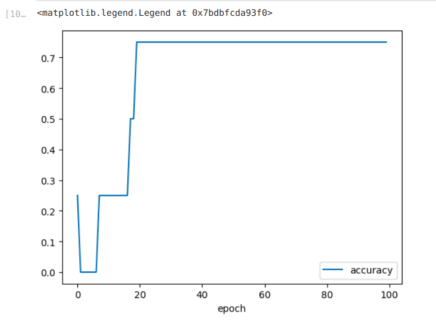
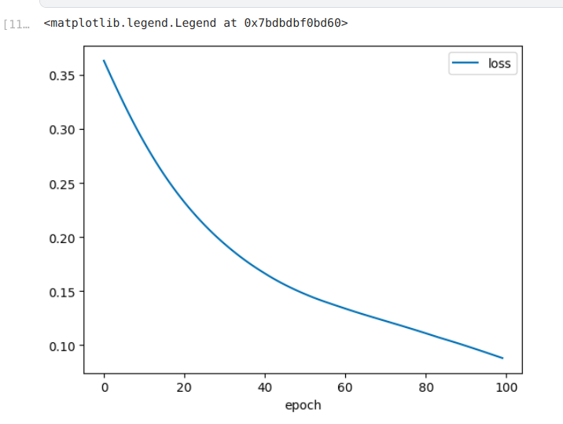
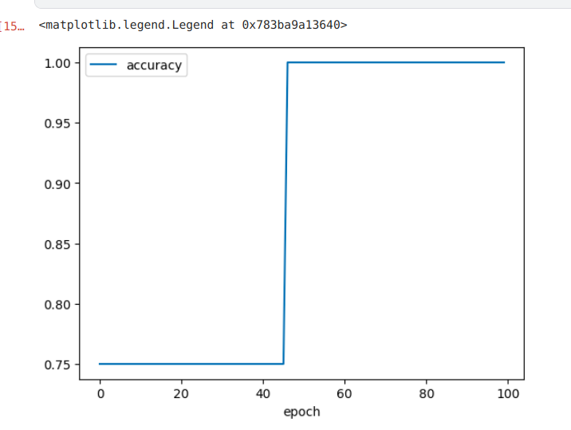
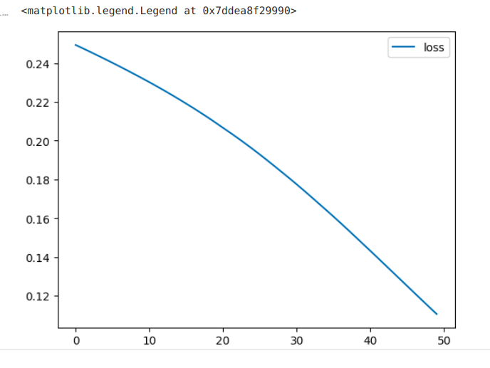
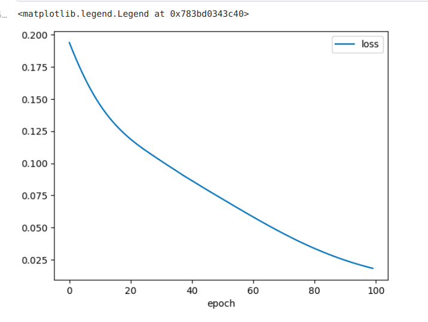

# NeuralLogicGates

Purpose of this repository is to showcase implementations of logic gates using neural networks. Logic gates are basic building blocks of any digital system. And using neural networks we can simulate their behaviour.

In this repository you will find implementations of various neural networks such as AND, OR and more. These implementations demonstrate how neural networks can learn the underlying logical rules and produce accurate outputs. 

## Try the Implementations Yourself!

### Requirements
- numpy, tensorflow

You can try the NeuralLogicGates(pretrained models) by using following code
```
# in repo's root directory
python3 run.py --gate gate_name --input input1 input2
```
- gate_name : give name of desired gate, ie. 'and', 'or' etc. you can use capital letters, lowercase letters, or a combination of both.
- input1 : give input1
- input2 : give input2

**example**
```
python3 run.py --gate Or --input 0 1
```
**output**
`output for 'Or' logic gate is 1`

## Accuray and Loss of each implementation 

### OR
<div>
  
  
</div>

### AND
<div>
  
  
</div>

### XOR
<div>
  
  
</div>
